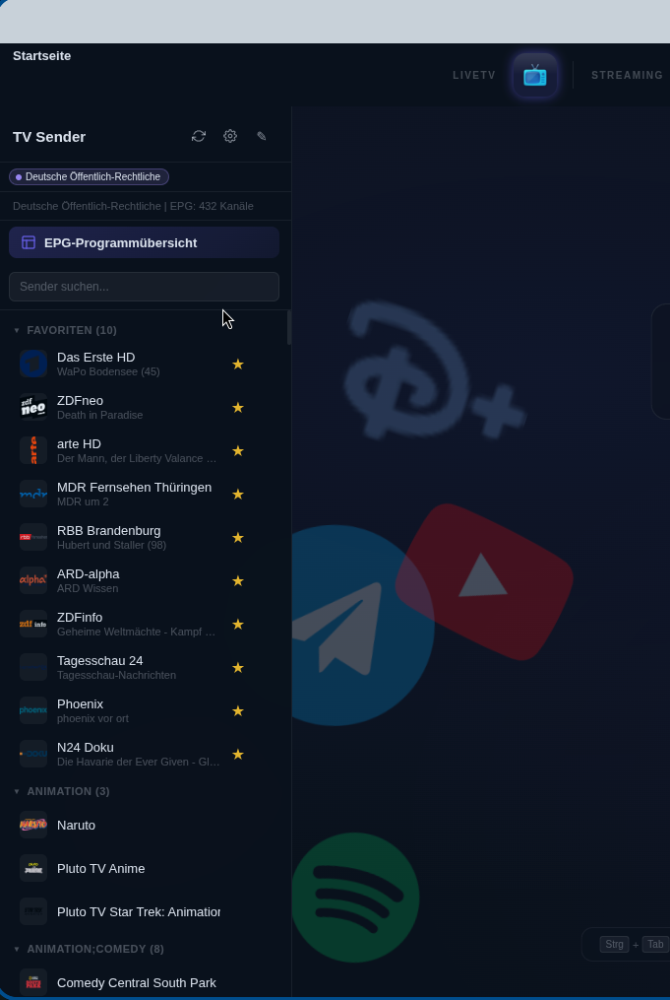

# Streaming Hub

Zentrale Streaming-Anwendung mit Widevine-DRM-Unterstützung über Castlabs Electron. Bündelt beliebte Streaming-Dienste in einer einheitlichen Oberfläche.

## Unterstützte Dienste

### Streaming
| Dienst | URL |
|---|---|
| Netflix | https://www.netflix.com |
| YouTube | https://www.youtube.com |
| Disney+ | https://www.disneyplus.com |
| Prime Video | https://www.primevideo.com |
| Twitch | https://www.twitch.tv |
| Spotify | https://open.spotify.com |

### Mediatheken
| Dienst | URL |
|---|---|
| ARD Mediathek | https://www.ardmediathek.de/ |
| ZDF Mediathek | https://www.zdf.de/ |
| ARTE | https://www.arte.tv/de/ |

## Funktionen

- **Dienst-Navigation** – Icon-Leiste mit Gruppen (Streaming/Mediatheken); erscheint bei Hover auf der kompakten Leiste
- **Live-TV** – M3U-Playlists laden, EPG, integrierter HLS-Player mit Sendersuche und Channel-Editor
- **EPG (Electronic Program Guide)** – XMLTV-Parsing mit Vollbild-Overlay, Favoriten-Ansicht, Zeitslots (2/4/8/12/24h)
- **Mediathek-Integration** – ARD/ZDF/arte-Suche via MediathekViewWeb-API
- **Picture-in-Picture** – Schwebe-Fenster für paralleles Streamen (auch TV-Streams)
- **Browser-Navigation** – Zurück, Vorwärts und Neu-laden über Webview-API
- **Compact-Overlay** – Leiste standardmäßig 24px, expandiert bei Hover auf 64px
- **Draggable Titlebar** – Fenster per Leiste verschiebbar
- **Widevine DRM** – Castlabs Electron mit VMP-Support (Netflix, Disney+, Prime Video)
- **Chrome Widevine Fallback** – Nutzt `/opt/google/chrome/WidevineCdm/` falls vorhanden
- **Custom User-Agent** – Chrome-identischer User-Agent (dynamisch via `process.versions.chrome`)
- **Session-Persistenz** – Persistente Partitionen (`persist:streaming`, `persist:tv`)
- **Permission-Handling** – Automatische Freigabe für Medien- und DRM-Anfragen
- **Willkommensbildschirm** – Logo-Hintergrund, animierter Pfeil, Hinweistext
- **Dark-UI** – Glasmorphismus mit anbieter-spezifischen Akzentfarben
- **Auto-Update** – Git-basiertes Update-System mit Gitea-API
- **Backup/Restore** – Einstellungen, Dienste, TV-Quellen, Verlauf sichern/wiederherstellen
- **Tastaturkürzel** – Strg+T (TV), Strg+H (History), Strg+P (PiP), F11 (Fullscreen)
- **typed-core Package** – TypeScript-Datenlogik (M3U-Parsing, EPG, TV-Channel) mit Unit-Tests

## Voraussetzungen

| Abhängigkeit | Version |
|---|---|
| **Node.js** | >= 22.12 |
| **npm** | (kommt mit Node.js) |
| **electron** (castlabs) | `v42.0.0+wvcus` |

## Installation

```bash
curl -fsSL http://192.168.4.105:3000/kekskarlo/Streaming-Hub/raw/branch/master/install.sh | bash
```

## Projektstruktur

```
Streaming-Hub/
├── main.js              # Electron-Hauptprozess (Fenster, DRM, Auto-Update)
├── preload.js           # Preload für Hauptfenster
├── preload-content.js   # Preload für Webview-Inhalte (Anti-Detection)
├── renderer.js          # UI-Logik, Webview-Steuerung (Source)
├── dist/renderer.js     # Gebündelte UI-Logik (esbuild)
├── logger.js            # Strukturiertes Logging
├── updater.js           # Auto-Update via Git/Gitea
├── index.html           # Haupt-UI
├── tv.html              # HLS-TV-Player
├── pip.html             # Picture-in-Picture-Fenster
├── styles.css           # Dark-UI, Animationen
├── start.sh             # Startskript (Linux/macOS)
├── start.cmd            # Startskript (Windows)
├── install.sh           # One-Line-Installer
├── package.json         # Abhängigkeiten + Workspaces
├── CHANGELOG.md         # Versionshistorie
├── services.json        # Streaming-Dienst-Konfiguration
├── tvsources.json       # TV-Quellen-Konfiguration
├── packages/
│   └── typed-core/      # TypeScript-Package (Datenlogik, M3U, EPG, TV)
│       ├── src/         # TypeScript-Source (format.ts, epg.ts, tv.ts, mediathek.ts)
│       ├── dist/        # Kompiliertes JS
│       └── tests/       # Vitest Unit-Tests
├── scripts/
│   ├── build-renderer.js  # esbuild-Bundler
│   └── watch-renderer.js  # Watch-Mode
└── assets/
    ├── icons/           # Dienst-Icons
    └── icon.svg         # App-Icon
```

## Bedienung

### Startseite

Beim Start zeigt die App einen Willkommensbildschirm mit den Logos der Streaming-Anbieter und einem animierten Pfeil, der zur Navigationsleiste zeigt. Die wichtigsten Tastaturkürzel werden direkt angezeigt.


### Navigationsleiste

Die Navigationsleiste befindet sich am oberen Bildschirmrand. Bewege die Maus an den oberen Rand, um sie zu erweitern.

Die Leiste ist in drei Gruppen unterteilt:
- **LiveTV** – TV-Icon zum Öffnen der TV-Sidebar
- **Streaming** – Netflix, YouTube, Disney+, Prime Video, Twitch, Spotify
- **Mediatheken** – ARD, ZDF, ARTE

Klicke auf ein Icon, um den entsprechenden Dienst zu öffnen. Die Leiste klappt automatisch ein, sobald ein Dienst ausgewählt ist.


### Streaming-Dienste nutzen

Nach dem Klick auf einen Dienst wird die Webseite im Hauptbereich geladen. Deine Login-Daten und Sessions werden gespeichert – du musst dich nur einmal anmelden.

### Live-TV

#### TV-Sidebar öffnen

Klicke auf das TV-Icon in der Navigationsleiste oder drücke `Strg+T`. Die TV-Sidebar öffnet sich am rechten Bildschirmrand und zeigt alle geladenen Sender.



#### TV-Quellen verwalten

In der TV-Sidebar klickst du auf das Zahnrad-Symbol (⚙), um TV-Quellen zu verwalten:
- **Quellen-Name** – z.B. "Deutsche Sender"
- **M3U-URL** – Link zu einer M3U-Playlist (oder lokale Datei über 📁)
- **EPG-URL** (optional) – Link zu einer XMLTV-Datei für Programminformationen
- **Akzentfarbe** – Farbe für die Quellen-Kennzeichnung

Eine vorkonfigurierte Quelle (Deutsche Öffentlich-Rechtliche) ist bereits enthalten.

#### Sender auswählen

Klicke in der Sidebar auf einen Sender, um ihn zu starten. Die Sidebar schließt sich automatisch und der TV-Player wird geladen.

Die Sender sind in Gruppen organisiert (z.B. "HD", "SD"). Klicke auf eine Gruppenüberschrift, um sie ein- oder auszuklappen.

#### Favoriten

Klicke auf den Stern (☆) neben einem Sender, um ihn als Favorit zu markieren. Favoriten werden oben in der Sidebar-Gruppe "Favoriten" gesammelt und können für die EPG-Programmübersicht genutzt werden.

#### Sender sortieren (Drag & Drop)

Ziehe einen Sender am Griff-Symbol (⠿) nach oben oder unten, um die Reihenfolge zu ändern. Die Sortierung wird automatisch gespeichert.

#### Kanalwechsel im TV-Modus

Im laufenden TV-Stream kannst du die Sender wechseln:
- **Pfeiltasten hoch/runter** – nächster/vorheriger Sender

Beim Wechsel erscheint kurz ein Kanal-Overlay mit dem aktuellen Sender und den umgebenden Kanälen (inkl. EPG-Info).

#### TV-Player Steuerung

Bewege die Maus, um die Steuerungs-Overlays einzublenden:

**Oben links:** Sendername + Logo

**Unten:** Komplette Player-Steuerung:
- **EPG-Leiste** – Aktuelle Sendung mit Uhrzeit
- **Play/Pause** – Button oder `Leertaste` / `K`
- **Lautstärke** – Slider oder `+` / `-`
- **Stumm** – Button oder `M`
- **Audiospur** – Dropdown bei Sendern mit mehreren Tonspuren
- **Vollbild** – Button oder `F`

#### Sender bearbeiten (Channel-Editor)

Klicke in der TV-Sidebar auf das Stift-Symbol (✎), um den Channel-Editor zu öffnen:
- **Name** – Anzeigename des Senders
- **URL** – Stream-URL überschreiben
- **tvg-id** – Zuordnung für EPG-Daten (mit Autovervollständigung aus EPG-Quellen)
- **Logo-URL** – Senderlogo überschreiben

Die Änderungen werden pro TV-Quelle gespeichert und sind sofort aktiv.

### EPG – Programmübersicht

Klicke in der TV-Sidebar auf "EPG-Programmübersicht", um die vollständige Programmübersicht zu öffnen.


Die EPG-Ansicht zeigt:
- **Zeitleiste** – Alle Favoriten-Sender mit Sendungen als Balken
- **Jetzt-Linie** – Vertikale Linie für die aktuelle Uhrzeit
- **Zeitslots** – Wähle 2h, 4h, 8h, 12h oder 24h Ansicht

Klicke auf eine Sendung für Details:
- **Sender öffnen** – Sender direkt starten
- **In Mediathek ansehen** – Sendung in ARD/ZDF/arte Mediathek suchen (falls verfügbar)


### Mediathek-Suche

Aus der EPG-Übersicht kannst du Sendungen direkt in den Mediatheken suchen. Der Button "In Mediathek ansehen" öffnet den entsprechenden Dienst (ARD, ZDF oder ARTE) mit dem Sendungstitel als Suchbegriff.

### Verlauf

Klicke auf das Uhr-Icon in der Navigationsleiste oder drücke `Strg+H`, um den Verlauf zu öffnen. Er zeigt die zuletzt abgespielten Inhalte mit Titel, Dienst und Zeitstempel.

Ein Klick auf einen Eintrag springt direkt zum entsprechenden Dienst oder TV-Sender. Mit "Löschen" kannst du den gesamten Verlauf leeren.


### Einstellungen

Klicke auf das Zahnrad-Icon in der Navigationsleiste, um die Einstellungen zu öffnen.


#### Backup & Restore
- **Backup erstellen** – Speichert Dienste, TV-Quellen und Verlauf als Datei
- **Backup einspielen** – Stellt ein vorheriges Backup wieder her

#### Dienste verwalten
- **Dienste hinzufügen** – Eigene Streaming-Dienste oder Mediatheken hinzufügen (Name, URL, Icon, Farbe, Gruppe)
- **Dienste entfernen** – Dienste mit dem ×-Button entfernen

#### TV-Modus
- **FreeTV** – TV-Button öffnet die Sidebar mit eigenen M3U-Sendern
- **MagentaTV** – TV-Button öffnet web.magentatv.de im Webview

### Tastaturkürzel

Drücke `?` für eine Übersicht aller Kürzel:

| Kürzel | Funktion |
|---|---|
| `Strg` + `Tab` | Nächster Dienst |
| `Strg` + `Umsch` + `Tab` | Vorheriger Dienst |
| `Strg` + `H` | Verlauf anzeigen |
| `Strg` + `T` | TV-Sidebar umschalten |
| `Strg` + `P` | Bild-in-Bild umschalten |
| `F11` | Vollbild umschalten |
| `?` | Kürzel-Übersicht |
| `Escape` | Modal / Overlay schließen |

**Im TV-Player zusätzlich:**

| Kürzel | Funktion |
|---|---|
| `Leertaste` / `K` | Play / Pause |
| `F` | Vollbild |
| `M` | Stumm schalten |
| `←` / `→` | 10s zurück / vor |
| `+` / `-` | Lautstärke hoch / runter |

### Auto-Update

Der Update-Button in der Navigationsleiste zeigt den Status:
- **Grüner Haken** – App ist aktuell
- **Roter Pfeil (pulsierend)** – Update verfügbar

Klicke auf den Button, um das Update zu starten. Die App lädt die neue Version herunter und startet automatisch neu.

## Lizenz

MIT
