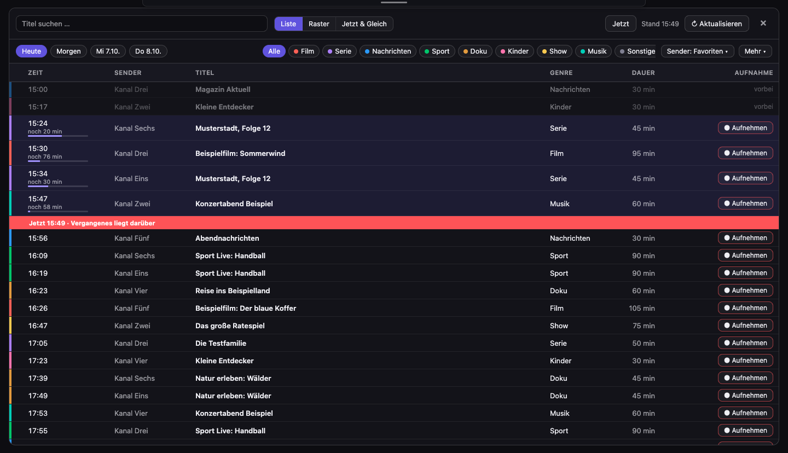
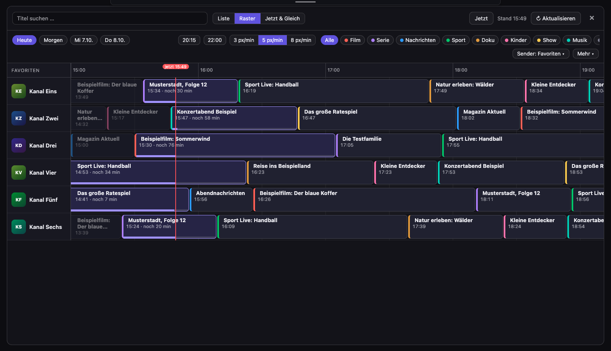
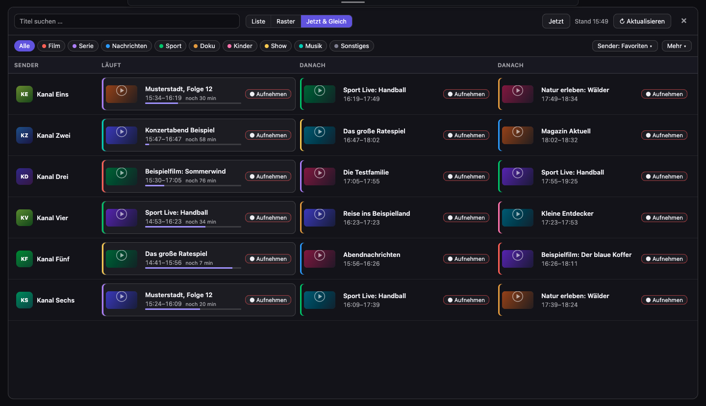
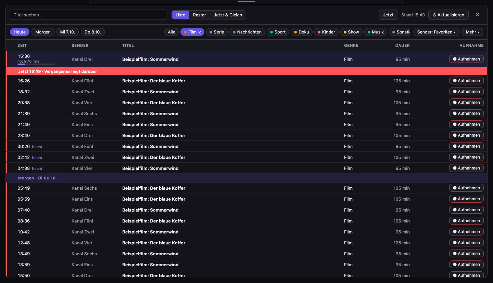
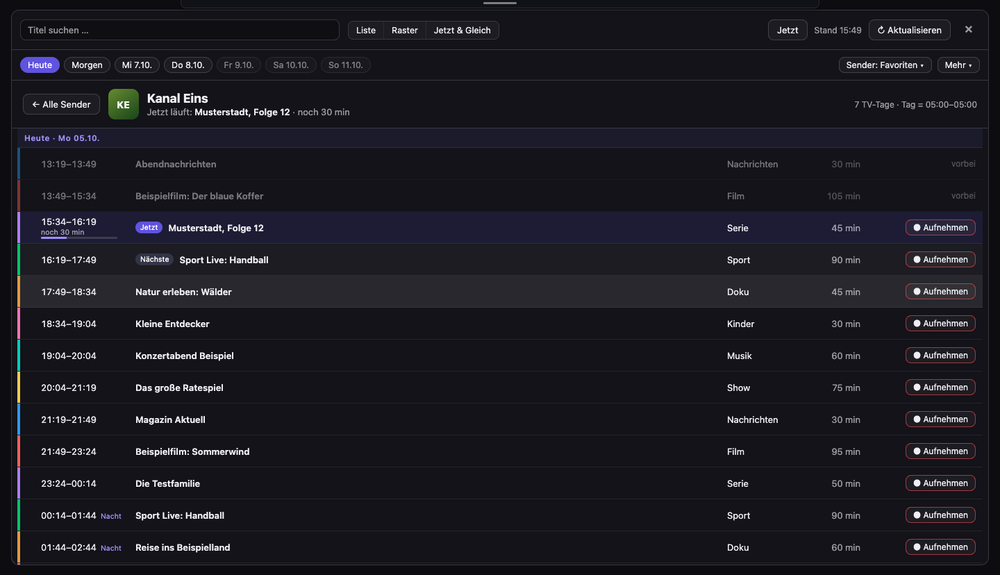
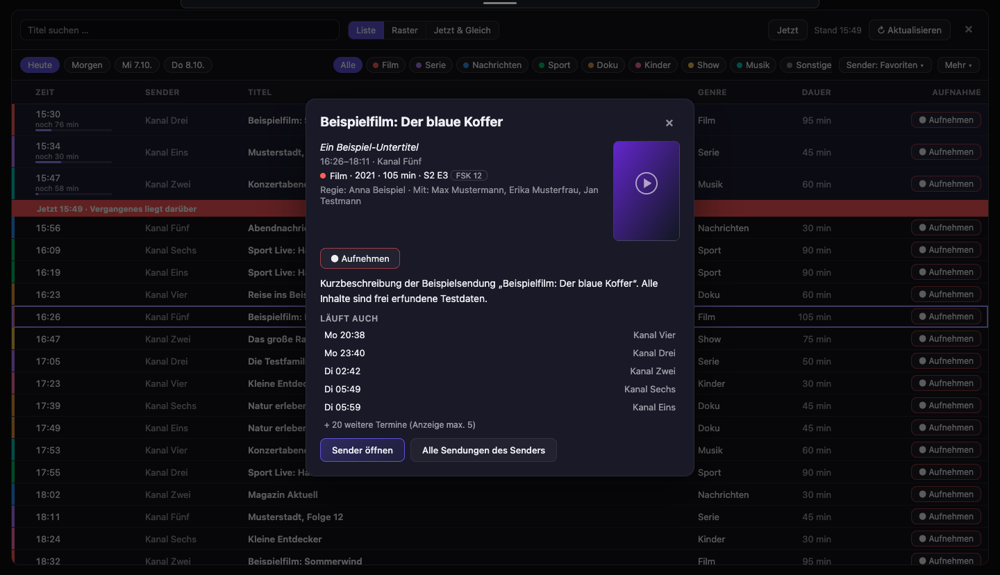

# Streaming Hub

Zentrale Streaming-Anwendung mit Widevine-DRM-Unterstützung über Castlabs Electron. Bündelt Streaming-Dienste, Mediatheken und Live-TV in einer einheitlichen Oberfläche. Der Installer unterstützt Linux x86_64 sowie macOS auf Intel- und Apple-Silicon-Macs.

## Unterstützte Dienste

### Streaming
| Dienst | URL |
|---|---|
| Netflix | https://www.netflix.com |
| YouTube | https://www.youtube.com |
| Disney+ | https://www.disneyplus.com |
| Prime Video | https://www.primevideo.com |
| Twitch | https://www.twitch.tv |
| Spotify | https://open.spotify.com |

### Mediatheken
| Dienst | URL |
|---|---|
| ARD Mediathek | https://www.ardmediathek.de/ |
| ZDF Mediathek | https://www.zdf.de/ |
| ARTE | https://www.arte.tv/de/ |

## Funktionen

- **Start-Dashboard** – Schnellzugriff auf Live-TV, Streaming-Dienste, Mediatheken, Aufnahmen und Einstellungen
- **Live-TV** – Sender-Kacheln, Favoriten, aktuell laufende Sendungen und Senderverwaltung (M3U-Quellen, Suche, Sortierung)
- **Programmführer (EPG)** – Vollbild-Programmübersicht als Liste, Raster oder „Jetzt & Gleich“, Suche, Senderauswahl, Genre-Filter, Kanalansicht mit 7 Tagen je Sender, Details mit Poster, Besetzung und weiteren Terminen, Aufnehmen, Abbrechen und Stoppen direkt in der Sendung
- **Aufnahmen** – Live-TV-Sendungen aufnehmen, auch vom Beginn der laufenden Sendung an, aus dem EPG im Voraus planen und später in der App abspielen
- **Zeitversetztes Fernsehen (Timeshift)** – Bei unterstützten Live-Streams zurückspulen und Sendungen per EPG-Marker anspringen
- **Mediathek-Suche** – ARD, ZDF und ARTE direkt aus der Programmübersicht durchsuchen
- **Bild-in-Bild** – Schwebendes Fenster für paralleles Schauen (auch TV-Streams)
- **Verlauf** – Zuletzt gesehene Inhalte mit Direktsprung
- **Streaming-DRM** – Netflix, Disney+ und Prime Video funktionieren mit Widevine
- **Gespeicherte Logins** – Du meldest dich bei jedem Dienst nur einmal an
- **Einstellungen** – Dienste, TV-Quellen, Sender, EPG, Wiedergabe und Aufnahmen an einem Ort
- **Backup/Restore** – Einstellungen, Dienste, TV-Quellen und Verlauf sichern und wiederherstellen
- **Auto-Update** – Neue Versionen direkt aus der App installieren
- **Tastaturkürzel** – für Navigation, Verlauf, Aufnahmen, Bild-in-Bild und Vollbild

## Voraussetzungen

| Voraussetzung | Unterstützung |
|---|---|
| **Node.js** | >= 22.12 |
| **npm** | Kommt mit Node.js |
| **Linux** | x86_64; Paketmanager apt, dnf, pacman oder zypper |
| **macOS** | Intel (x64) und Apple Silicon (arm64) |

## Installation

Unter Linux und macOS erkennt der Installer Betriebssystem und Architektur automatisch:

```bash
curl -fsSL https://raw.githubusercontent.com/keks-maker/streaming-hub/main/install.sh | bash
```

Unter Linux wird die App standardmäßig nach `~/.local/share/streaming-hub` installiert und im Anwendungsmenü eingetragen. Unter macOS liegen die App-Dateien standardmäßig in `~/Library/Application Support/Streaming Hub`; das native App-Bundle für Finder und Dock wird unter `~/Applications/Streaming Hub.app` installiert. Ein abweichender Installationspfad kann über `INSTALL_DIR` gesetzt werden.

Der Installer kann Node.js unter Linux über den jeweiligen Paketmanager installieren. Auf macOS nutzt er Homebrew, falls Node.js fehlt oder zu alt ist und Homebrew bereits installiert ist.

Homebrew-Installation (https://brew.sh/):
```bash
/bin/bash -c "$(curl -fsSL https://raw.githubusercontent.com/Homebrew/install/HEAD/install.sh)"
```

Andernfalls müssen Node.js und npm vorher installiert sein. Windows wird von `install.sh` nicht unterstützt.

### Manueller macOS-Download (ZIP aus dem Browser)

Die App ist nicht notarisiert (kein Apple-Developer-Account); das Bundle ist nur
ad-hoc signiert. Wird das ZIP manuell im Browser geladen, setzt macOS das
Quarantäne-Flag und Gatekeeper blockiert den ersten Start:

- Entpacken, `Streaming Hub.app` nach `/Applications` ziehen, beim ersten Start
  Rechtsklick → **Öffnen** → **Öffnen** bestätigen (ggf. unter Systemeinstellungen →
  Datenschutz & Sicherheit → „Trotzdem öffnen“).
- Meldet macOS „Streaming Hub ist beschädigt und kann nicht geöffnet werden“,
  Quarantäne-Flag entfernen: `xattr -cr "/Applications/Streaming Hub.app"`

Installationen über den In-App-Updater oder den Installer sind nicht betroffen
(kein Quarantäne-Flag).

## Bedienung

### Startseite

Die Startseite bündelt die Bereiche Live-TV, Streaming, Mediatheken, Aufnahmen und Einstellungen. Wähle eine Kachel, um den Bereich zu öffnen.


### Navigationsleiste

In den Bereichen erscheint die Navigationsleiste am oberen Bildschirmrand. Sie wechselt zwischen Live-TV, Streaming, Mediatheken, Aufnahmen und Einstellungen.


### Streaming-Dienste nutzen

Nach dem Klick auf einen Dienst wird die Webseite im Hauptbereich geladen. Deine Login-Daten und Sessions werden gespeichert – du musst dich nur einmal anmelden.

### Live-TV

#### Live-TV-Dashboard öffnen

Wähle in der Navigationsleiste **LiveTV**. Das Dashboard zeigt geladene Sender als Kacheln, Favoriten sowie die aktuelle EPG-Programmübersicht. Über **Alle Sender** öffnest du die Senderverwaltung.


#### Sender verwalten

Die Senderverwaltung findest du unter **Einstellungen → LiveTV → Sender** (auch über **Senderverwaltung** im Live-TV-Dashboard). Sie bietet eine Suche, getrennte Ansichten für alle Sender und Favoriten sowie Sortierung und Senderbearbeitung (Name, EPG-Zuweisung, Logo, Stream-URL). Ein Hinweis zeigt, ob zu einem Sender EPG-Daten gefunden wurden.


#### TV-Quellen verwalten

Öffne **Einstellungen → LiveTV → Quellen**, um TV-Quellen zu pflegen. Du kannst Quellen hinzufügen, bearbeiten und entfernen:
- **Name** – z.B. „Deutsche Sender“
- **M3U-URL** – Link zu einer M3U-Playlist (oder lokale Datei über 📁)
- **EPG-URL** (optional) – Link zu einer XMLTV-Datei für Programminformationen
- **Farbe** – Kennzeichnung der Quelle

Favoriten und Anpassungen bleiben beim Bearbeiten einer Quelle erhalten. Eine vorkonfigurierte Quelle (Deutsche Öffentlich-Rechtliche) ist bereits enthalten. Unter **LiveTV → EPG** siehst du die EPG-URL je Quelle und kannst das Programm manuell aktualisieren.

#### Sender auswählen

Klicke eine Sender-Kachel im Live-TV-Dashboard oder einen Eintrag in der Senderverwaltung an, um den Stream zu starten. Die Senderverwaltung lässt sich über **Alle Sender** öffnen und bietet Suche sowie Gruppen.

#### Favoriten

Klicke in der Senderverwaltung auf den Stern (☆), um einen Sender als Favorit zu markieren. Im Tab **Favoriten** kannst du die Favoriten separat ansehen und sortieren.

#### Favoriten sortieren

Öffne in der Senderverwaltung den Tab **Favoriten**, wähle **Reihenfolge bearbeiten** und verschiebe Sender per Drag & Drop. Die Sortierung wird gespeichert.

#### Kanalwechsel im TV-Modus

Im laufenden TV-Stream kannst du die Sender wechseln:
- **Pfeiltasten hoch/runter** – nächster/vorheriger Sender

Beim Wechsel erscheint kurz ein Kanal-Overlay mit dem aktuellen Sender und den umgebenden Kanälen (inkl. EPG-Info).

#### TV-Player Steuerung

Bewege die Maus, um die Steuerungs-Overlays einzublenden:

**Oben links:** Sendername + Logo

**Unten:** Komplette Player-Steuerung:
- **EPG-Leiste** – Aktuelle Sendung mit Uhrzeit
- **DVR-Leiste** – Sendungsmarker anklicken, zurückspulen oder mit `L` zur Live-Kante springen (bei unterstützten Streams)
- **Play/Pause** – Button oder `Leertaste` / `K`
- **Lautstärke** – Slider oder `+` / `-`
- **Stumm** – Button oder `M`
- **Audiospur** – Dropdown bei Sendern mit mehreren Tonspuren
- **Vollbild** – Button oder `F`

#### Sender bearbeiten

Unter **Einstellungen → LiveTV → Sender** verwaltest du alle Sender: Suche, Filter nach Quelle, Favoriten per Stern und Reihenfolge der Favoriten. Wähle einen Sender, um ihn anzupassen:
- **Name** – Anzeigename
- **EPG-Zuordnung** – Programmdaten (tvg-id) zuweisen, mit Auswahlliste
- **Logo-URL** – Senderlogo ersetzen, mit Vorschau
- **Stream-URL** – Stream überschreiben, mit „Auf Original zurücksetzen“

Die Änderungen werden pro TV-Quelle gespeichert und sind sofort aktiv.

#### Aufnahmen

Live-TV-Sendungen lassen sich direkt im TV-Player aufnehmen und später ansehen. Voraussetzung ist, dass die Aufnahme-Komponente (ffmpeg) verfügbar ist; ihren Status zeigt **Einstellungen → LiveTV → Aufnahmen**.

**Aufnahme starten:** Klicke im TV-Player unten auf den Aufnahme-Button (Ring mit Punkt) oder drücke `R`. Es erscheint ein Dialog mit drei Optionen:
- **Ab Bildposition starten** – Beginnt an der Stelle, die du gerade im Zeitversatz ansiehst (am Live-Bild nicht verfügbar)
- **Aktuell angezeigte Sendung aufnehmen** – Nimmt die laufende Sendung ab ihrem Anfang auf, sofern dieser noch im Zeitversatz-Fenster des Senders liegt
- **Bis zum Ende der Sendung** – Nimmt ab jetzt auf und stoppt automatisch am Sendungsende (benötigt EPG-Daten)

Nicht verfügbare Optionen sind ausgegraut; ein Hinweis nennt den Grund. Es laufen standardmäßig bis zu drei Aufnahmen gleichzeitig (je Sender eine); das Limit ist unter **Einstellungen → LiveTV → Aufnahmen → Parallele Aufnahmen** einstellbar. Wird es überschritten, fragt die App, ob du trotzdem aufnehmen möchtest.


**Laufende Aufnahme:** Oben im Player zeigt ein „REC“-Hinweis mit Laufzeit, Sender und Sendung, dass aufgenommen wird – auch wenn du den Sender wechselst. Ein Klick darauf (oder auf den roten Aufnahme-Button) öffnet die Verwaltung zum Beenden. Aufnahmen laufen weiter, wenn du das Fenster schließt: Die App bleibt dann im Tray (Symbol rot bei laufender Aufnahme) und lässt sich von dort öffnen oder die Aufnahme stoppen. Reißt die Verbindung kurz ab, versucht die App automatisch, die Aufnahme fortzusetzen; nach einem Absturz werden unvollständige Aufnahmen beim nächsten Start gerettet.

**Aufnahmen ansehen:** Öffne auf der Startseite die Kachel **Aufnahmen** oder drücke `Strg` + `R`. Die Übersicht zeigt Titel, Sender, Datum, Dauer und Status jeder Aufnahme. Hier kannst du Aufnahmen abspielen und löschen. Während eine Aufnahme nach dem Beenden in das MP4-Format umgewandelt wird, siehst du den Fortschritt; fertige Aufnahmen liegen als normale MP4-Dateien im Speicherordner und lassen sich auch mit anderen Playern öffnen.


**Aufnahmen planen:** Klicke im Programmführer bei einer Sendung, die in der Zukunft liegt, auf **Aufnehmen** (in Liste, Raster, Kanalansicht oder Details). Der Planungsdialog zeigt Vor- und Nachlauf (Puffer) und warnt bei Konflikten mit dem Parallel-Limit. Geplante Aufnahmen siehst du im Tab **Geplant** der Aufnahmen-Übersicht; dort kannst du die Puffer ändern oder den Eintrag absagen. Die Aufnahme startet im Hintergrund, auch bei geschlossenem Fenster – die App muss dafür laufen (im Tray genügt). Verschiebt sich die Sendung im EPG, übernimmt die App die neuen Zeiten und weist am Eintrag darauf hin; verschwindet die Sendung aus dem EPG, wird nur gewarnt. Wurde der Start verpasst (App aus, Standby), startet die Aufnahme bei noch laufender Sendung sofort. Das Programm der nächsten Tage hält die App als Wochen-Cache vor und aktualisiert es im Hintergrund.

**Beenden und Tray:** Steht innerhalb der nächsten 24 Stunden eine Aufnahme an, fragt die App beim Schließen oder Beenden nach, ob sie im Hintergrund bleiben soll (**Im Hintergrund behalten** / **Trotzdem beenden**). Das Tray-Menü listet die nächsten geplanten Aufnahmen und bietet **Planung öffnen**. Während einer Aufnahme (und kurz vor geplanten Aufnahmen) verhindert die App ihre Suspendierung; einen schlafenden Rechner weckt sie nicht.

**Speicherort:** Standardmäßig `~/Videos/Streaming Hub`. Unter **Einstellungen → LiveTV → Aufnahmen** kannst du einen anderen Ordner wählen (auch Netzwerkpfade, mit Warnhinweis). Der Wechsel ist nur möglich, solange keine Aufnahme läuft. Dort stellst du auch den **Puffer** vor und nach der Sendung (0–30 Minuten, Standard 2 und 5), die **Reserve freier Speicher** (Standard 1 GB, Minimum 512 MB; darunter stoppt die Aufnahme kontrolliert) und den **Spätstart** ein.


> **Hinweis:** Aufnahmen funktionieren für Live-TV-Sender aus deinen M3U-Quellen, nicht für DRM-geschützte Streaming-Dienste.

### EPG – Programmführer

Klicke im Live-TV-Dashboard auf **EPG öffnen** (oder in der TV-Seitenleiste auf den EPG-Button), um den Programmführer als Vollbild-Overlay aufzurufen. Er zeigt die Sender deiner Favoriten, die EPG-Daten haben; ohne Favoriten erscheint ein Hinweis mit **Alle Sender zeigen**. Die Daten kommen aus dem Programm-Cache der App, der im Hintergrund aktualisiert wird (**Aktualisieren** zeigt den Stand).



**Liste, Raster und Jetzt & Gleich:** Oben wechselst du mit dem Schalter **Liste | Raster | Jetzt & Gleich** die Darstellung; Senderauswahl, Tag, Zeitpunkt und Auswahl bleiben dabei erhalten. Womit sich der Programmführer öffnet, stellst du unter **Einstellungen → LiveTV → EPG → Startansicht des Programmführers** ein (Automatisch, Liste, Raster, Jetzt & Gleich); „Automatisch“ zeigt ab 900 Pixel Fensterbreite die Liste, in schmaleren Fenstern „Jetzt & Gleich“. Der Schalter im Programmführer gilt nur für die aktuelle Sitzung.
- **Liste** (Standard) – Alle Sendungen nach Startzeit mit Zeit, Sender, Titel, Genre und Dauer. Die Trennlinie „Jetzt“ markiert die aktuelle Uhrzeit, die laufende Sendung zeigt Fortschritt und „noch N min“, Vergangenes ist gedämpft, Nachtsendungen vor 05:00 gehören zum Vorabend (Badge „Nacht“).
- **Raster** – Sender als Zeilen, Sendungen als Blöcke auf einer Zeitachse mit roter Jetzt-Linie, Senderlogos und Zoom (3, 5 oder 8 px/min); Schnellsprünge zu 20:15 und 22:00.
- **Jetzt & Gleich** – Je Sender die laufende Sendung (mit Fortschritt), die nächste und die übernächste; ein Klick auf eine Sendung öffnet die Details, ein Klick auf den Sendernamen die Kanalansicht. Jede Zelle zeigt links ein kleines Vorschaubild; fehlt es, bleibt ein Platzhalter mit dem Anfangsbuchstaben. Die Anzeige aktualisiert sich alle 30 Sekunden und ist auch in schmalen Fenstern ohne Scrollen zur Seite nutzbar.
- **Tage** – Die Tabs (Gestern, Heute, Morgen, Wochentage) springen auf 05:00 des jeweiligen TV-Tags; **Jetzt** springt zur aktuellen Zeit. Das Genre erscheint als Spalte und Farbbalken.





**Suche und Senderauswahl:** Das Suchfeld oben durchsucht die Titel der gewählten Sender (ab 2 Zeichen; Umlaute und Groß-/Kleinschreibung spielen keine Rolle). Die Treffer erscheinen als Liste mit Titel, Sender, Wochentag und Uhrzeit; ein Klick springt zum Termin und öffnet die Details, `Esc` leert und verlässt die Suche. Unter **Mehr ▾** lässt sich zusätzlich die Beschreibung durchsuchen und festlegen, ob Sender ohne EPG ausgeblendet werden (Standard). Über **Sender ▾** wählst du Favoriten (Standard), Alle Sender, eine Quelle oder eine Gruppe; die Auswahl gilt in Liste, Raster, Jetzt & Gleich und Suche und bleibt für die Sitzung erhalten.

**Genre-Filter:** Die Chips unter der Kopfzeile filtern nach Genre: Film, Serie, Nachrichten, Sport, Doku, Kinder, Show, Musik und Sonstiges. Du kannst mehrere Gruppen kombinieren; **Alle** oder ein Klick auf das ✕ am aktiven Chip hebt den Filter auf. In Liste und Jetzt & Gleich werden nicht passende Sendungen ausgeblendet, im Raster gedämpft; auch die Suche berücksichtigt den Filter. Sendungen ohne Genre-Angabe passen zu keiner aktiven Gruppe. Der Filter bleibt beim Moduswechsel und beim erneuten Öffnen des Programmführers erhalten, in der Kanalansicht sind die Chips ausgeblendet.



**Kanalansicht:** Klicke auf einen Sendernamen (Liste oder Raster) oder im Sendungsdetail auf **Alle Sendungen des Senders**, um alle Sendungen dieses Senders für 7 TV-Tage zu sehen. **← Alle Sender** oder `Esc` führt zurück, ohne dass Ansicht und Scrollposition verloren gehen. Mit **+ Weitere Tage** blendest du die Tage 8–14 ein, soweit der Cache reicht.



**Sendungsdetails:** Ein Klick auf eine Sendung öffnet die Details mit Beschreibung, einer Infozeile (Genre, Jahr, Dauer, Staffel und Folge), Besetzung (Regie und Mitwirkende), Poster, Untertitel und Altersfreigabe – jeweils nur, wenn die EPG-Quelle diese Angaben liefert. Der Abschnitt **Läuft auch** nennt bis zu 5 weitere Termine derselben Sendung; ein Klick springt dorthin. Außerdem gibt es **Sender öffnen** und **In Mediathek ansehen** (ARD/ZDF/arte, falls verfügbar). `Esc` schließt Details bzw. den Programmführer.



**Aufnehmen, Abbrechen, Stoppen:** Jede Sendung hat einen Knopf, der zum Zustand passt: **● Aufnehmen** (öffnet den Planungsdialog), **✕ Aufnahme abbrechen** (geplant, mit Rückfrage) oder **■ Aufnahme stoppen** (läuft, mit Rückfrage). Das Beenden einer laufenden Aufnahme meldet zuerst „wird beendet …“ und danach das Ergebnis. Aufnehmen lässt sich nur bei Sendungen, die noch nicht begonnen haben; laufende Sendungen nimmst du im TV-Player auf. Geplant wird bis 8 Tage im Voraus (darüber erscheint ein Hinweis).

**Marker:** Ein roter Punkt kennzeichnet Sendungen mit Aufnahme: statisch bei geplanter, pulsierend bei laufender Aufnahme. Die Marker aktualisieren sich live.

### Mediathek-Suche

Aus dem Programmführer kannst du Sendungen direkt in den Mediatheken suchen. Der Button "In Mediathek ansehen" öffnet den entsprechenden Dienst (ARD, ZDF oder ARTE) mit dem Sendungstitel als Suchbegriff.

### Verlauf

Klicke auf das Uhr-Icon in der Navigationsleiste oder drücke `Strg+H`, um den Verlauf zu öffnen. Er zeigt die zuletzt abgespielten Inhalte mit Titel, Dienst und Zeitstempel.

Ein Klick auf einen Eintrag springt direkt zum entsprechenden Dienst oder TV-Sender. Mit "Löschen" kannst du den gesamten Verlauf leeren.


### Einstellungen

Klicke auf das Zahnrad-Icon in der Navigationsleiste, um die Einstellungen zu öffnen. Links wählst du eine Seite aus:

- **Allgemein** – Backup & Restore
- **LiveTV** – Quellen, Sender, EPG, Wiedergabe (TV-Modus) und Aufnahmen
- **Streaming** – Streaming-Dienste hinzufügen und entfernen
- **Mediatheken** – Mediatheken hinzufügen und entfernen


#### Backup & Restore
- **Backup erstellen** – Speichert Dienste, TV-Quellen und Verlauf als Datei
- **Backup einspielen** – Stellt ein vorheriges Backup wieder her

#### Dienste verwalten
Über **+** fügst du eigene Streaming-Dienste oder Mediatheken hinzu (Name, URL, Icon, Farbe); mit dem ×-Button entfernst du sie wieder.

#### TV-Modus
- **FreeTV** – TV-Button öffnet die Sidebar mit eigenen M3U-Sendern
- **MagentaTV** – TV-Button öffnet web.magentatv.de im Webview

### Tastaturkürzel

Drücke `?` für eine Übersicht aller Kürzel:

| Kürzel | Funktion |
|---|---|
| `Strg` + `Tab` | Nächster Dienst |
| `Strg` + `Umsch` + `Tab` | Vorheriger Dienst |
| `Alt` + `←` | Zurück zur vorherigen Ansicht |
| `Strg` + `H` | Verlauf anzeigen |
| `Strg` + `R` | Aufnahmen öffnen |
| `Strg` + `T` | Live-TV öffnen |
| `Strg` + `P` | Bild-in-Bild umschalten |
| `F11` | Vollbild umschalten |
| `?` | Kürzel-Übersicht |
| `Escape` | Modal / Overlay schließen |

**Im TV-Player zusätzlich:**

| Kürzel | Funktion |
|---|---|
| `Leertaste` / `K` | Play / Pause |
| `F` | Vollbild |
| `M` | Stumm schalten |
| `←` / `→` | 10s zurück / vor |
| `L` | Zur Live-Kante springen (DVR-Streams) |
| `R` | Aufnahme starten bzw. verwalten |
| `+` / `-` | Lautstärke hoch / runter |

### Auto-Update

Der Update-Button in der Navigationsleiste zeigt den Status:
- **Grüner Haken** – App ist aktuell
- **Roter Pfeil (pulsierend)** – Update verfügbar

Klicke auf den Button, um das Update zu starten. Die App lädt die neue Version herunter und startet automatisch neu. Laufende Aufnahmen solltest du vorher beenden.

## Lizenz

MIT
